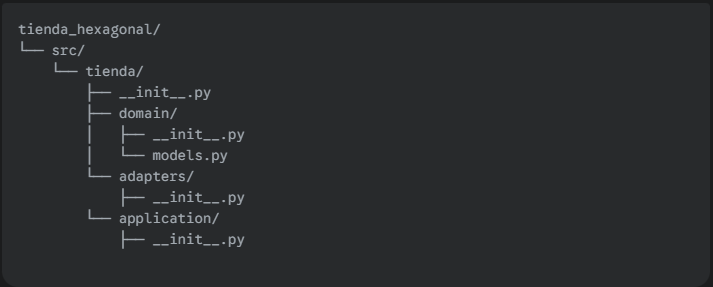

# ✍️ Tu Misión de Hoy

Tu misión es crear la estructura de carpetas de nuestro nuevo proyecto y definir los modelos de dominio puros.

### 1️⃣ Crea la Estructura de Carpetas
> Crea esta estructura en tu computadora. Será la base de nuestra aplicación limpia.

* domain/: Nuestro núcleo. Hoy trabajaremos aquí.

* application/: Aquí vivirán nuestros servicios, que usan el dominio (lo veremos mañana).

* adapters/: Aquí vivirá el código que conecta con el mundo exterior (lo veremos más adelante).

---

### 2️⃣ Define tus Modelos de Dominio

Abre el archivo ***src/tienda/domain/models.py***.

* Dentro de este archivo, define las clases puras para tus modelos de dominio. Basa tu trabajo en el código de tienda_limpia.py, pero asegúrate de que sea completamente independiente.

* Crea una clase Orden que pueda gestionar una lista de items.

* Debe tener métodos como `agregar_item()` y `calcular_total()`.

* Importante: La nueva clase Orden no debe tener un método `procesar_pago()` ni `calcular_peso_total()`. Esas son lógicas de aplicación u orquestación que irán en los servicios más adelante, no son parte intrínseca del modelo Orden.

* Define también las clases `Libro` y `CursoOnline` (puedes basarte en las clases concretas que ya hiciste).

* El objetivo de hoy es tener un archivo **models.py** que contenga el corazón de nuestro negocio, sin ninguna dependencia externa. ¡Adelante!