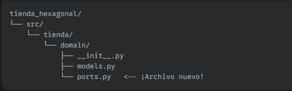

✍️ Tu Misión de Hoy
Tu misión es crear un nuevo archivo para nuestros puertos y definir en él todas las interfaces que nuestra lógica de negocio necesitará.

1. Crea el Archivo de Puertos
Dentro de tu carpeta de dominio, crea un nuevo archivo. Tu estructura ahora se verá así:



---

2. Define los Puertos
Abre tu nuevo archivo src/tienda/domain/ports.py. Ahora, define las siguientes interfaces (ABCs) dentro de él. ¡Te darás cuenta de que ya has diseñado la mayoría de ellas!

Puerto de Pago: Mueve la definición de tu ABC MetodoPago que creaste en el proyecto de refactorización a este archivo.

Puerto de Notificación: Mueve la definición de tu ABC INotificacion (o como la hayas llamado) a este archivo.

Puerto de Persistencia (El Nuevo): Este es el que dedujiste en tu diagrama. Necesitamos un contrato para guardar y recuperar órdenes. Crea una nueva ABC llamada IOrdenRepository.

Debe tener un método abstracto llamado guardar. Este método recibirá un objeto de tipo Orden.

(Opcional) Puedes añadirle otro método abstracto como buscar_por_id que reciba un id y devuelva una Orden.

Aquí tienes una plantilla para el nuevo repositorio:

```python
# Dentro de src/tienda/domain/ports.py
from abc import ABC, abstractmethod
from .models import Orden # Importamos Orden desde nuestro mismo dominio

# ... (Aquí irían tus ABCs de MetodoPago e INotificacion) ...

class IOrdenRepository(ABC):
    @abstractmethod
    def guardar(self, orden: Orden):
        """Guarda una orden en el sistema de persistencia."""
        pass

    # (Opcional, pero buena práctica)
    # @abstractmethod
    # def buscar_por_id(self, orden_id: int) -> Orden:
    #     """Busca una orden por su identificador único."""
    #     pass
```

El objetivo de hoy es tener un único archivo, ports.py, que defina todos los contratos que nuestro núcleo le exige al mundo exterior. 