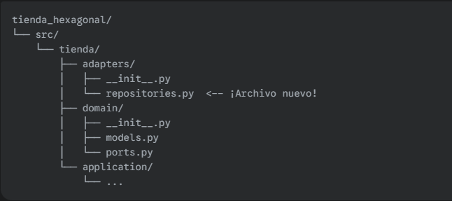

✍️ Tu Misión de Hoy
Tu misión es implementar tu primer adaptador secundario: un repositorio de órdenes que funciona en memoria.

1. Crea la Estructura para los Adaptadores
Dentro de tu carpeta src/tienda/, crea una nueva carpeta adapters. Dentro de ella, crea un archivo repositories.py. Tu estructura se verá así:



2. Implementa el Adaptador de Repositorio
Abre el nuevo archivo src/tienda/adapters/repositories.py.

Importa el puerto IOrdenRepository y el modelo Orden desde la capa de dominio.

Crea una nueva clase InMemoryOrdenRepository que herede de IOrdenRepository.

Implementa los métodos requeridos: guardar y buscar_por_id.

Para simular una base de datos, puedes usar un diccionario dentro de la clase para almacenar las órdenes.

Aquí tienes una plantilla para guiarte:

```python
# Dentro de src/tienda/adapters/repositories.py
from tienda.domain.ports import IOrdenRepository
from tienda.domain.models import Orden

class InMemoryOrdenRepository(IOrdenRepository):
    def __init__(self):
        # Usamos un diccionario para simular una tabla de base de datos
        self._ordenes = {}
        # Un contador para simular los IDs autoincrementales
        self._next_id = 1

    def guardar(self, orden: Orden):
        # Aquí va tu lógica:
        # 1. Asigna un ID a la orden (puedes añadir un atributo 'id' a la clase Orden si quieres).
        # 2. Guarda la orden en el diccionario self._ordenes usando el ID como clave.
        # 3. Incrementa el contador self._next_id.
        pass # Reemplaza con tu lógica

    def buscar_por_id(self, orden_id: int) -> Orden:
        # Aquí va tu lógica:
        # 1. Busca la orden en el diccionario self._ordenes.
        # 2. Si la encuentras, devuélvela.
        # 3. Si no, puedes devolver None o lanzar un error.
        pass # Reemplaza con tu lógica
```

Con este paso, habrás conectado tu primer "cable" a tu núcleo de negocio, haciendo que tu arquitectura sea tangible y funcional.