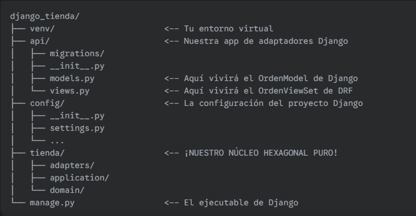

✍️ Misión de Hoy: Montar el Entorno Profesional
Hoy no escribiremos lógica de negocio, sino que haremos el trabajo de infraestructura para montar un proyecto profesional desde cero.

---

Paso 1: Crear el Espacio de Trabajo
En tu computadora, crea una nueva carpeta para todo el proyecto, llámala django_tienda. Abre tu terminal dentro de esa carpeta, la carpeta estara al nivel de la semana 3 ya que vamos a trabajar sobre ella toda la semana.

Paso 2: Crear un Entorno Virtual
Un entorno real siempre empieza con un entorno virtual para aislar las dependencias del proyecto.

```bash
# 1. Crea el entorno virtual (la carpeta se llamará 'venv')
python -m venv venv
# 2. Activalo
.\venv\Scripts\activate
```
Verás (venv) al principio de la línea de tu terminal. Esto significa que estás dentro del entorno.

Paso 3: Instalar las Dependencias
Ahora, instalemos Django y Django REST Framework.

```bash
pip install django djangorestframework
```

Paso 4: Iniciar el Proyecto y la App de Django
Vamos a crear la estructura de Django.

```bash
# 1. Crea el proyecto. 'config' es para los ajustes, '.' lo crea en la carpeta actual.
django-admin startproject config .

# 2. Crea la app que contendrá nuestros adaptadores de API.
python manage.py startapp api
```

Paso 5: Integrar Nuestro Núcleo Hexagonal
Este es el paso clave. Ve a la carpeta de tu proyecto tienda_hexagonal que ya construimos, y copia la carpeta src/tienda completa y pégala dentro de la raíz de tu nuevo proyecto django_tienda.

¡Listo! Tu Estructura Profesional
Al final de estos pasos, tu proyecto django_tienda tendrá esta estructura:



---

Tu Tarea de Hoy
Sigue los 5 pasos anteriores para crear y configurar tu proyecto django_tienda.

Abre config/settings.py y añade 'api' y 'rest_framework' a tu lista de INSTALLED_APPS.

Ejecuta python manage.py runserver en tu terminal para confirmar que el proyecto de Django se inicia sin errores.

Una vez que tengas el servidor de desarrollo de Django corriendo, habrás completado la configuración inicial. Mañana, empezaremos a escribir código y crearemos nuestro primer adaptador real: el DjangoOrdenRepository, que conectará nuestro dominio con el ORM de Django.